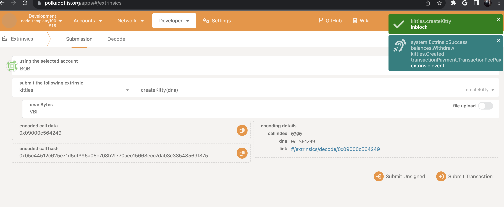
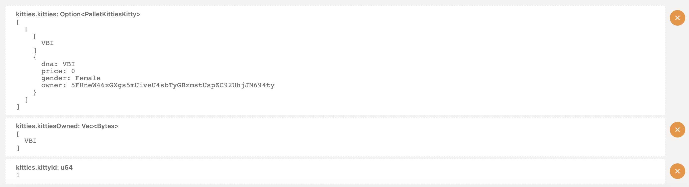
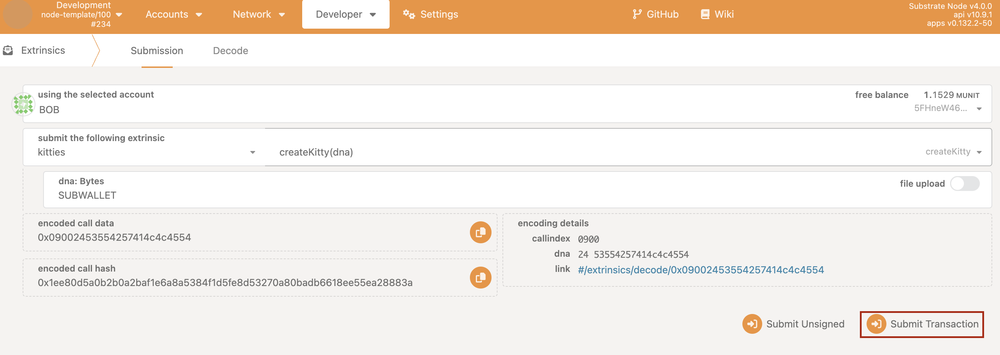
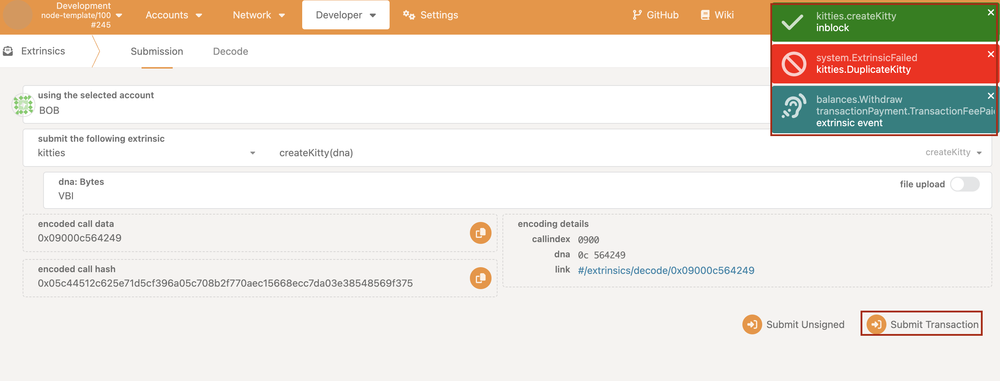

## Exercise 02: Create Pallet-kitties 

 EXERCISE 02 : Create Pallet Kitties 

  
  

  
 STEP 1 

  <strong>Define 3 on-chain storages</strong>
  <ul>
    <li> KittyId : StorageValue </li>
    <li> Kitties : StorageMap(DNA => Kitty) </li>
    <li>KittiesOwned : StorageMap(AccountId => Vec(DNA))</li>
  </ul>

  

  

  
 STEP 2 

    <strong>Define Event and Error (There are some suggestions in the code section)</strong>
  

    

  
 STEP 3 

    <strong>Create helper function `gen_dna`:</strong>
      <ul>
    <li> Input : DNA  </li>
    <li> if dna length is even return Male else return Female </li>
    <li>Output: Result(Gender, Error(T)))</li>
  </ul>
  

  

  
 STEP 4 

  <strong>Create extrinsic call `create_kitty`</strong>
  <ul>
    <li>generate gender and declair new kitty</li>
    <li>Check duplicate kitty, 1 kitty has different dna</li>
    <li> Get current kitty id </li>
    <li> Add new kitty to  on-chain storage KittiesOwned </li>
    <li> Write new kitty to storage Kitties and KittyId </li>
    <li> Emit Create Event </li>
  </ul>

  

  

  
 STEP 5 

    <strong>Verify whether your extrinsic call logic is correct or not. Remember to start your local node and access polkadotjs explorer</strong>
  <ul>
    <li>Create first kitty successfully</li>
    
    <li>Access on-chain storage </li>
    
    <li>Create second kitty successfully</li>
    
    <li>Create duplicate kitty -> Emit DuplicateKitty Error </li>
    
  </ul>

  

